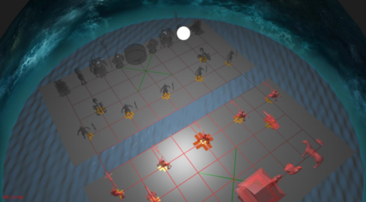
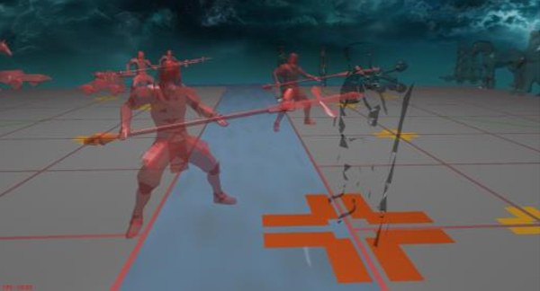

# 介绍

## 展示

总体棋盘展示

水波模型

棋子模型

棋子移动：被攻击模型消散过程

棋子移动：模型跳跃

具体情况可见文件夹中展示视频

## 系统设计

我们的棋盘是在X-Z平面的，初始时相机指向的方式是(0,0,-1);
即，程序刚开始启动的时候。
正对方向是z的负方向，右手边是x的正方向，头上是y的正方向
棋盘的中心坐标是(0,2,0);
我们用一个9*10的矩阵来表示棋盘的每一个落子点。
其中左上角的第一个落子点对应于棋盘矩阵的(0,0);
列增加的方向是x正方向
行增加的方向是z正方向

头文件说明：
项目的所有类声明和定义都是写在一起的，全部集成在一个头文件里。
没有采用声明和定义分文件的做法。

MYTOOLKIT.h
里面有一个类 Toolkit
这个类全是静态成员。。
其实主要是用来做一个命名空间封装。。
我们用这个类记录一些全局的状态和参数，以及一些上下文初始化。

CAMERA.h
包含一个类Camera
是相机类
其中静态方法processInput是用来检测键盘活动的，
从而改变相机的位置，方向，视角
所有对相机位置进行改变的操作，
都是通过成员方法updatePos完成的。
这个方法接受一个三维向量，表示相机位置移动的增量
在updatePos中，会对增量做检测，非法的移动会被过滤掉。
所以做碰撞检测，最后肯定是要从这个方法出发的。

SQUARE.h
含一个类Square
这个类的实例对象对应的就是一块矩形片
我们的棋盘,棋盘上的线,标记,实际上底层都是它。

CHESSBOARD.h
含一个类chessBoard，这是棋盘的顶层对象
这个类含有几个比较重要的成员
Square *Line[26];这是棋盘上纵横若干条线
boardCross *corss[2];这是棋盘上双方主将所行区域的那个×型线条
Square *groundObj[3];这是棋盘的盘面,我们切割成了三块进行渲染
chessManager *myManager;这是用来管理棋盘逻辑的对象!!

CHESSMANAGER.h
含四个类
boardCross对应的是棋盘上x形线条
Tag对应的是棋盘上兵，炮初始位置的几个target型图标
Focus对应的是我们棋盘上可移动的光标,这个类里面还封装了
关于focus事件的一些内容。。
应该重点关注的是chessManager类,这是管理我们棋盘逻辑的类。
可以看到它下面管理了Focus图标，水流面。
最重要的是这个对象：chessGo* myChess;
这个对象具体的管理了棋盘上棋子的布局，移动，规则

CHESSGO.h
含一个类chessGo
棋盘上32个棋子都是被编号的
int board[9][10]记录的是棋盘上每个位置当前的棋子。
如果为0表示没有,如果为i,表示这个位置上现在有一个编号为i的棋子
glm::vec2 pos[9][10]记录的是棋盘上每个位置在对应的世界坐标
Model *modelResource[14];总计有14总棋子模型,在渲染开始前会预加载到Model对象中
chessModel *myChess[33];
对应着32个具体的棋子;棋子的放缩,旋转,移动等调整,全部交给它管理
nurbsCar *myCar;红方的车是用nurbs曲面建模出来的,所以用单独的一个对象来管理
int type[33];表示编号为i的棋子的类型。。类型就是这个头文件里面#define的那几种
在实现中，我们把被消灭的棋子的type变成自己的相反数（负数）来作为它被消灭的标志。
int locX[33] 与 int locY[33]:记录每个棋子的坐标。。
PS:注意，这里的坐标是指的棋盘矩阵坐标，而不是世界坐标系。。

对于CHESSGO.h,应该重点关注chessModel对象,是它管理着每个具体的棋子

chessModelManager.h
含一个类 chessModel
记录了每个棋子的旋转，平移，放缩
同时保存了每个棋子的模型矩阵
所有棋子的运动，都要调用这个对象去完成
这个对象接受两种模型,一种是标准的加载进来的网格模型,
一种是我们自建的nurbs曲面模型

LIGHT.h
含一个类Light
管理光源参数和光源的渲染

MODEL.h/MESH.h
封装好的标准模型文件加载器
可以加载.obj模型

NURBSCAR.h
含一个类,nurbsCar
管理我们用nurbs曲面建模建出来的车模型

SHADER.h
含一个Shader类
用来加载，编译，链接我们的着色器程序
所有与着色器之间的参数交流都是通过这个Shader对象进行的

SKY.h
含一个sky类
管理天空渲染
天空实际上就是一个带贴图的半球体

TEXT.h
渲染文本的类
主要用来显示FPS..

TEXTURE.h
含三个类
MyTexture类是管理贴图对象的
Material类管理材质,材质是直接和片段着色器挂钩的。
Skybox已经被弃用了，以前我们用天空盒来渲染环境，现在我们采用天空球了。

WATERFLOW.h
含一个类waterFlow
管理水波对象
水的波动计算都是在其顶点着色器中进行的

关于碰撞检测的建议：
1.相机的所有参数都封装在相机类里面。碰撞检测的第一步应该是确定自己的尺寸，
也就是说应该在相机类里面添加一些参数表示自己的形状，大小。
2.其实要检测的碰撞只有观察者和棋子模型之间。所以应该关注的是所有棋子。
在CHESSGO.h中我们加载和配置了棋子。通过type[id]可以获得编号为id的棋子的类型。
通过locX[id],locY[id]可以获得这个棋子在棋盘矩阵上的行号和列号。
通过pos[rowId][colId]可以获得棋盘矩阵对应位置的世界坐标
3.我们要做的其实就是比较摄像机世界坐标和每个棋子的世界坐标
4.碰撞检测的第一步：把每一个棋子都用一个盒子包裹起来。
你可以分别为每个棋子设上一个盒子，然后画出来，这个盒子当然要随时跟着棋子一起动。
棋子的移动逻辑都封装在chessModelManager.h中，你在这里面为每个棋子加个盒子就好了
并且要为不同类型的棋子设定合身的盒子尺寸
5.碰撞检测的第二步: 在updatePos里面去和每个盒子检测相交。
这可能需要一些向量运算。你在建盒子的时候，应该要考虑这些参数。
6.碰撞检测的第三步：对于会导致碰撞的分量，过滤掉，不更新到摄像机位置上。

